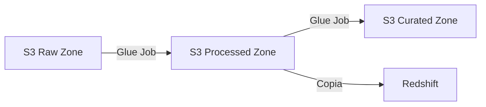
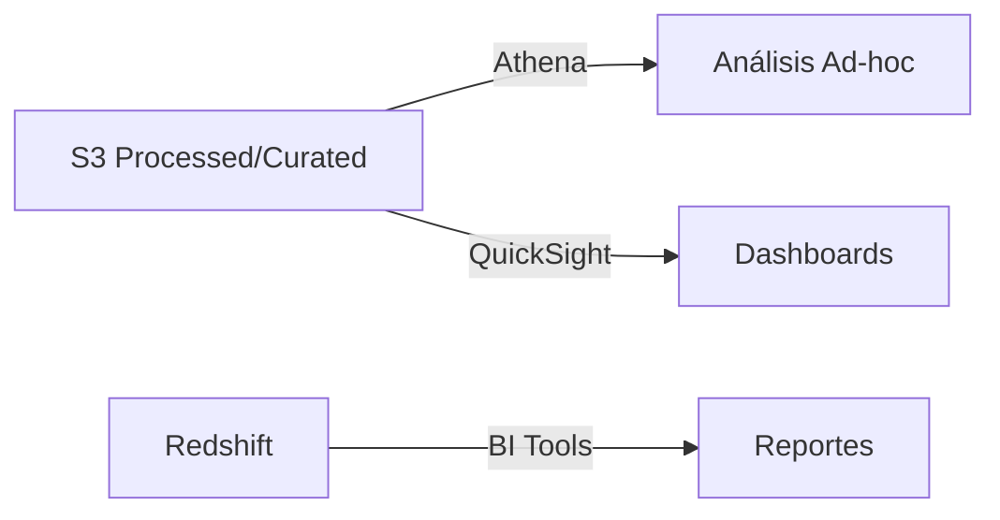

# Arquitectura del Data Lake para Comercializadora de Energía

## Descripción General

Este documento describe la arquitectura completa del sistema de Data Lake implementado para la comercializadora de energía, incluyendo todos los componentes, flujos de datos y consideraciones de seguridad.

## Componentes Principales

### 1. Capa de Almacenamiento (S3)

#### Raw Zone (Bronze)
- **Propósito**: Almacenamiento de datos crudos en formato CSV
- **Estructura**:
  ```
  s3://energy-trading-datalake-dev/raw/
  ├── providers/
  │   └── YYYY-MM-DD/
  │       └── providers.csv
  ├── clients/
  │   └── YYYY-MM-DD/
  │       └── clients.csv
  └── transactions/
      └── YYYY-MM-DD/
          └── transactions.csv
  ```
- **Retención**: 90 días
- **Particionamiento**: Por fecha de carga

#### Processed Zone (Silver)
- **Propósito**: Datos transformados y validados en formato Parquet
- **Estructura**:
  ```
  s3://energy-trading-datalake-dev/processed/
  ├── providers/
  │   └── year=YYYY/month=MM/day=DD/
  ├── clients/
  │   └── year=YYYY/month=MM/day=DD/
  └── transactions/
      └── year=YYYY/month=MM/day=DD/
  ```
- **Optimizaciones**: 
  - Compresión Snappy
  - Particionamiento por fecha
  - Indexación de columnas clave

#### Curated Zone (Gold)
- **Propósito**: Datos agregados y optimizados para análisis
- **Estructura**:
  ```
  s3://energy-trading-datalake-dev/curated/
  ├── daily_energy_consumption/
  ├── provider_performance/
  └── client_analytics/
  ```
- **Actualizaciones**: Diarias
- **Formato**: Parquet optimizado para Athena

### 2. Procesamiento de Datos

#### AWS Glue
- **Crawlers**:
  - `raw-data-crawler`: Escanea datos crudos
  - `processed-data-crawler`: Actualiza esquemas procesados
  
- **Jobs ETL**:
  1. `raw-to-processed`:
     - Validación de datos
     - Conversión a Parquet
     - Particionamiento
  2. `processed-to-curated`:
     - Agregaciones
     - Cálculos de métricas
     - Optimización de consultas

#### Lake Formation
- **Gobierno de Datos**:
  - Catálogo centralizado
  - Control de acceso granular
  - Auditoría de accesos

### 3. Análisis y Consulta

#### Amazon Athena
- **Workgroups**:
  - `analysts`: Para análisis ad-hoc
  - `reporting`: Para informes programados
  - `data-science`: Para exploración avanzada

#### Amazon Redshift
- **Esquemas**:
  - `raw_data`: Réplica de datos crudos
  - `analytics`: Tablas agregadas
  - `reporting`: Vistas optimizadas

## Flujos de Datos

### 1. Ingesta de Datos


### 2. Procesamiento


### 3. Consumo de Datos


## Seguridad

### 1. Control de Acceso
- IAM Roles específicos por función
- Políticas de mínimo privilegio
- Lake Formation para gobierno de datos

### 2. Encriptación
- En reposo: S3 con SSE-KMS
- En tránsito: TLS 1.2+

### 3. Networking
- VPC endpoints para servicios AWS
- Subnets privadas para Redshift
- Security Groups restrictivos

### 4. Auditoría
- CloudTrail para acciones API
- S3 Access Logs
- Lake Formation audit logs

## Monitoreo

### 1. Métricas Operativas
- Latencia de jobs
- Tasa de éxito/error
- Volumen de datos procesados

### 2. Alertas
- Fallas en jobs de Glue
- Errores de particionamiento
- Problemas de permisos

### 3. Dashboards
- Estado del pipeline
- Uso de recursos
- Costos operativos

## Consideraciones de Costos

### 1. Optimizaciones
- Compresión de datos
- Lifecycle policies en S3
- Reserva de capacidad en Redshift

### 2. Monitoreo de Costos
- AWS Cost Explorer
- Presupuestos por componente
- Alertas de uso

## Disaster Recovery

### 1. Backup
- Replicación cross-region de S3
- Snapshots de Redshift
- Backup del catálogo de Glue

### 2. RPO/RTO
- RPO: 24 horas
- RTO: 4 horas

### 3. Procedimientos
- Restauración de datos
- Recuperación de metadata
- Validación de integridad 